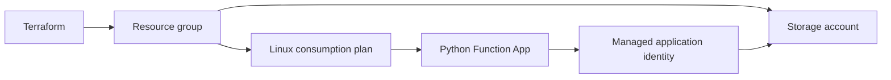

# Azure Data Platform Infrastructure

A modernized version of my original Terraform Function App project. It provisions a resource group, storage account, Linux consumption plan, Python Function App, and a scoped blob-data role for the application's managed identity.

## Architecture



## Validate without Azure credentials

Terraform 1.9.8, AzureRM 4.38.0, Random 3.7.2:

```bash
terraform init -backend=false
terraform fmt -check -recursive
terraform validate
terraform test
```

Mock-provider tests check TLS, private blob defaults, HTTPS, the consumption-plan choice, and invalid-name rejection. GitHub Actions and Azure DevOps run validation only and never apply resources.

## Optional deployment to an Azure sandbox

Install Azure CLI and authenticate with `az login`. Set `ARM_SUBSCRIPTION_ID` in your environment, copy `terraform.tfvars.example` to `terraform.tfvars`, review `terraform plan`, and apply only when you intend to create billable resources. No Azure deployment is part of local verification.

The infrastructure creates an empty Function App. `function-app/` contains an optional authenticated CSV validation endpoint. From that directory, with Azure Functions Core Tools installed, deploy using `func azure functionapp publish <function-app-name>`. POST a CSV with `id,value` columns to `/api/validate` and supply your function key through the `x-functions-key` header. Do not put function keys in URLs or repository files.

## Configuration and state

The subscription is supplied through environment configuration rather than source code. Names use a configurable prefix and random suffix. Resources are tagged; output values expose names and hostname only. The Function host uses a storage key passed by Terraform; that key is present in state even though it is not output. The managed identity and blob role are for application data access, not keyless host-storage authentication.

For a shared environment, configure an access-controlled remote state backend and OIDC deployment identity before applying. The example allows public service endpoints with authentication; it does not implement private networking. Treat it as a sandbox reference, not a production security baseline. Runtime behavior, region availability, quota, and application deployment require a live Azure verification.

## Changes from the initial repository

- Replaced older App Service/Function resource types with `azurerm_service_plan` and `azurerm_linux_function_app`.
- Removed the hard-coded subscription ID, centralized variables and tags, and created the resource group explicitly.
- Replaced the hello-world pipeline with formatting, provider initialization, validation, and mock tests.
- Added setup, architecture, state handling, and optional function deployment instructions.

Reference: [AzureRM Linux Function App documentation](https://registry.terraform.io/providers/hashicorp/azurerm/4.38.0/docs/resources/linux_function_app).
